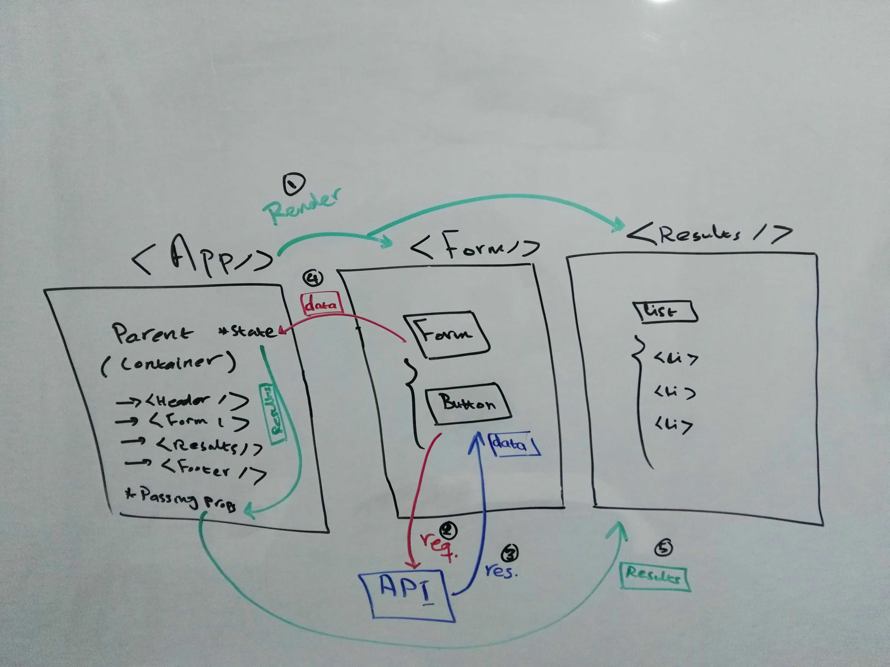

# RESTy
# LAB 28 - Props and State

**RESTy Phase 3:** Connect RESTy with APIs, running live requests

## Links & Resources

- [deployed site](https://bushra-401-advanced-javascript.github.io/resty/) 

## Phase 3 Requirements

In phase 3, we will be connecting RESTy to live APIs, fetching and displaying remote data. Our primary focus will be to service GET requests.  

The following user stories detail the major functionality for this phase of the project:

- As a user, I want to enter the URL to an API and issue a GET request so that I can retrieve it’s data
- As a user, I want to see the results returned from an API request in my browser in a readable format

## Setup/Run 

- clone the app repo
- move into `my-app` deirctory => `cd my-app`
- install the dependencies => `npm i`
- run the app => `npm run start`

## UML

