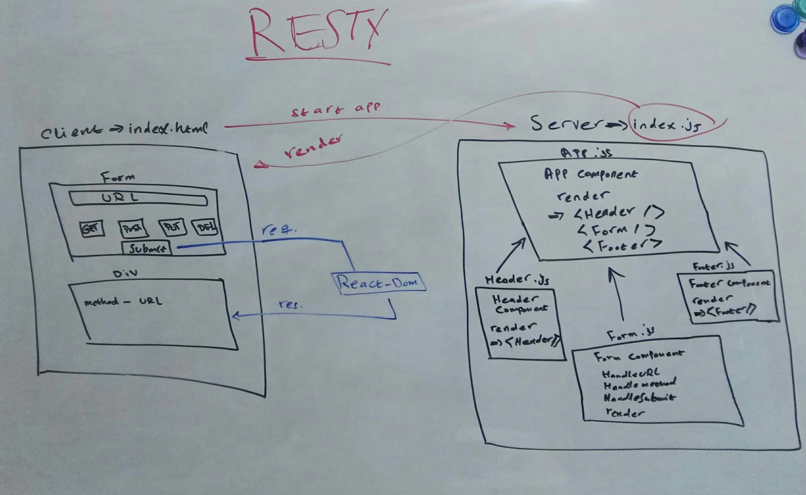

# RESTy
# LAB 26 - Component Based UI

**RESTy Phase 1:** Begin work on the RESTy API testing application

## Links & Resources

- [deployed site](https://bushra-401-advanced-javascript.github.io/resty/) 

## Phase 1 Requirements

In phase 1, our goal is to setup the basic scaffolding of the application, with intent being to add more functionality to the system as we go.  
This initial build sets up the file structure so that we can progressively build this application in a scalable manner.  

The following user stories detail the major functionality for this phase of the project:

- As a user, I expect an easy to read and understand user interface so that I can use the application intuitively
- As a user, I want to enter the URL to a REST API and select the REST method to use to access it
- As a user, I want visual confirmation that my entries and selections are valid so that I have confidence the application will be able to fetch the API data that I’ve requested

## Setup/Run 

- clone the app repo
- move into `my-app` deirctory => `cd my-app`
- install the dependencies => `npm i`
- run the app => `npm run start`

## UML

